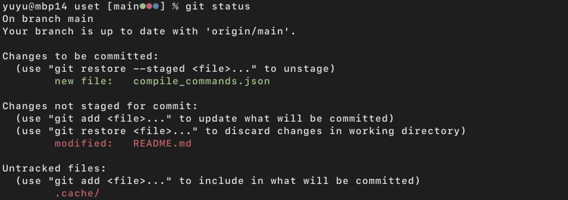

<!-- vim-markdown-toc GFM -->

* [macOS-SingularisArt prompt](#macos-singularisart-prompt)
  * [Installation](#installation)
  * [Features](#features)
* [Credit](#credit)

<!-- vim-markdown-toc -->

# macOS-SingularisArt prompt

(just looks like the default macOS prompt)


## Installation

### Using [zap](https://www.zapzsh.org)

Put the following your .zshrc file:

```zsh
typeset -A __Prompt

plug "yuyuranium/macOS-singularisart-prompt"
```

## Features

Visible here are:

- Concise default macOS prompt:
  - `user@machine`
  - Current working directory
- Extended features:
  - Current version control branch name.
  - Current version control worktree status using colors that match those used
    in `git status`:
    - Green dot indicates staged changes.
    - Red dot indicates unstaged changes.
    - Blue dot indicates untracked files.



If the last command exited with a non-zero status (usually indicative of an
error), a red exclamation is shown:


If there are background processes, a yellow asterisk is shown:


# Credit

This zsh prompt is inspired by [SingularisArt]([GitHub - zap-zsh/singularisart-prompt: Custom Prompt.](https://github.com/zap-zsh/singularisart-prompt)), and I tweaked it according to my own liking and the default macOS prompt.
